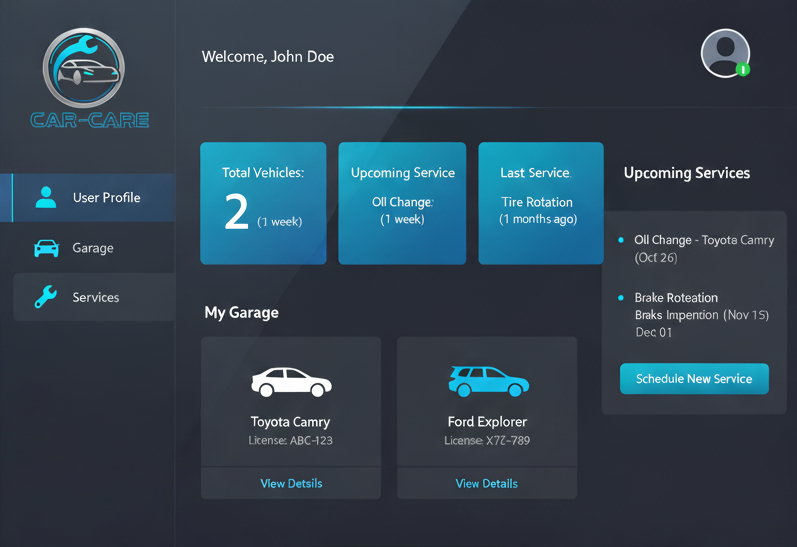
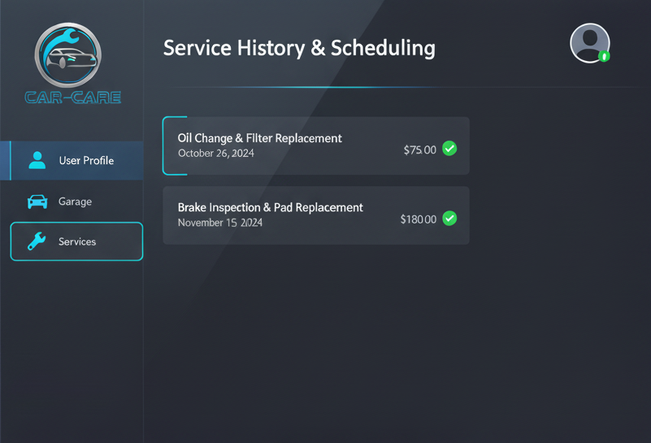
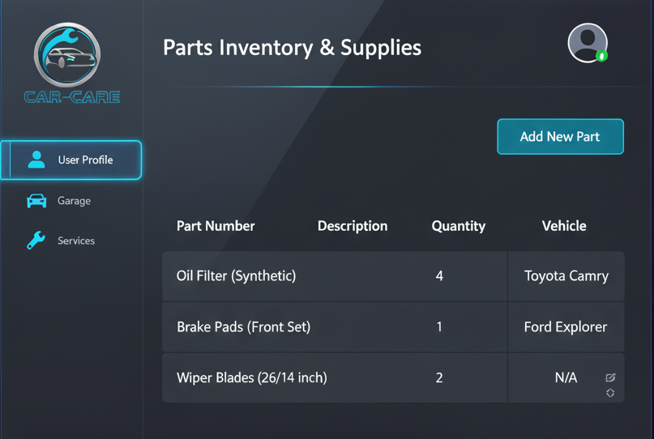

# Webfejlesztés beadandó - Örkényi Vilmos
## Car-Care

### Téma
- Egy weboldal, amely segítségével járművek szervízelését, költségeit lehet dokumentálni.
- Az oldal egy sqlite adatbázist használ az adatok tárolására.
- A back-end flask alapon fut, a front-end react. 
### Funkciók
- Felhasználók létrehozása.
- Járművek létrehozása és hozzárendelése a felhasználóhoz.
- A jármű fontosabb adatainak tárolása(márka, modell, évjárat, rendszám, vételi ár).
- A szervíz bejegyzések tartalmazzák az elvégzett tevékenység rövid elnevezését, leírását, dátumát, a felhasznált alkatrészeket és a szolgáltatás költségét.

### Szerver endpoint-ok
## Felhasználó
- Regisztráció
- Bejelentkezés
- Kijelentkezés

## Jármű
- Aktuális felhasználó járműveinek lekérdezése
- Jármű hozzáadása, módosítása, törlése

## Szervízek
- Adott jármű szervízbejegyzéseinek lekérdezése
- Szervízbejegyzés létrehozása, módosítása, törlése

## Alkatrészek
- Adott felhasználó összes alkatrészének lekérdezése
- Alkatrészek hozzáadása, módosítása, törlése

## Tervek
- A tervek törekedtek a minimalista, de egyben modern megjelenésre.
> A főoldal gyors áttekintést nyújt a felhasználó járműveiről, legutóbbi tevékenységeiről

> A szervíz oldalon láthatók a szerelések, azok költségei

> Az alkatrészek oldalon tárolható a megvásárolt alkatrészek, az is, hogy melyik alkatrészből mennyi áll rendelkezésre. Ez azért fontos, mivel előfordulhat, hogy veszünk egy alkatrészt, de nem kerül egyből beszerelésre, így nyomon követhető, hogy miből tartunk "raktáron".
